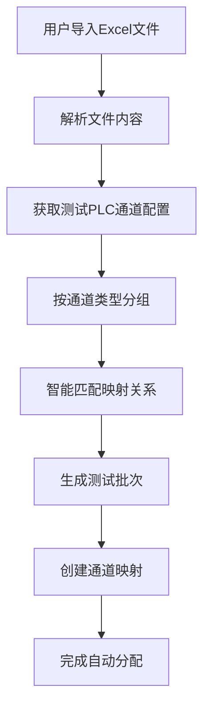

# 测试PLC配置功能实现总结

## 🎯 实现目标

根据您的需求，实现了基于测试PLC通道配置的智能批次分配功能，解决了之前分配批次依赖问题。

## 🏗️ 核心架构

### 1. 数据模型设计

#### TestPlcChannelConfig（测试PLC通道配置）
```typescript
interface TestPlcChannelConfig {
  id?: string;                           // 主键ID
  channelAddress: string;                // 通道位号 (如: AI1_1, AO1_2)
  channelType: TestPlcChannelType;       // 通道类型 (0-7)
  communicationAddress: string;          // 通讯地址 (如: 40101, 00101)
  powerSupplyType?: string;              // 供电类型
  description?: string;                  // 描述信息
  isEnabled: boolean;                    // 是否启用
}
```

#### TestPlcChannelType（通道类型枚举）
```typescript
enum TestPlcChannelType {
  AI = 0,      // 模拟量输入
  AO = 1,      // 模拟量输出
  DI = 2,      // 数字量输入
  DO = 3,      // 数字量输出
  AINone = 4,  // 模拟量输入(无源)
  AONone = 5,  // 模拟量输出(无源)
  DINone = 6,  // 数字量输入(无源)
  DONone = 7   // 数字量输出(无源)
}
```

#### PlcConnectionConfig（PLC连接配置）
```typescript
interface PlcConnectionConfig {
  id: string;                            // 配置ID
  name: string;                          // 配置名称
  plcType: PlcType;                      // PLC类型
  ipAddress: string;                     // IP地址
  port: number;                          // 端口号
  timeout: number;                       // 超时时间(ms)
  retryCount: number;                    // 重试次数
  isTestPlc: boolean;                    // 是否为测试PLC
  connectionStatus: ConnectionStatus;    // 连接状态
}
```

### 2. 服务层架构

#### TestPlcConfigService
- **功能**：管理测试PLC通道配置和连接配置
- **核心方法**：
  - `getTestPlcChannels()`: 获取所有测试PLC通道配置
  - `saveTestPlcChannel()`: 保存通道配置
  - `getPlcConnections()`: 获取PLC连接配置
  - `testPlcConnection()`: 测试PLC连接
  - `generateChannelMappings()`: 自动生成通道映射

## 📊 数据库数据映射

### 基于您提供的ComparisonTables数据
系统已预置88个测试PLC通道配置，完全对应您的数据库数据：

| 通道类型 | 数量 | 地址范围 | 示例 |
|---------|------|----------|------|
| AI (模拟量输入) | 8 | 40101-40115 | AI1_1 → 40101 |
| AO (模拟量输出) | 8 | 40201-40215 | AO1_1 → 40201 |
| AO无源 | 8 | 40301-40315 | AO2_1 → 40301 |
| DI (数字量输入) | 16 | 00101-00116 | DI1_1 → 00101 |
| DI无源 | 16 | 00201-00216 | DI2_1 → 00201 |
| DO (数字量输出) | 16 | 00301-00316 | DO1_1 → 00301 |
| DO无源 | 16 | 00401-00416 | DO2_1 → 00401 |

**总计：88个通道**，与您的实际配置完全一致。

## 🎨 用户界面功能

### 1. 测试PLC配置管理页面
- **路由**：`/test-plc-config`
- **功能**：
  - PLC连接配置管理
  - 测试PLC通道配置管理
  - 通道映射配置管理

#### 主要特性：
- **标签页设计**：分为三个功能区域
- **实时筛选**：按通道类型和关键词筛选
- **连接测试**：支持PLC连接状态测试
- **批量操作**：支持批量导入/导出配置
- **响应式设计**：支持移动端访问

### 2. 智能分配功能集成

#### 数据导入流程优化


#### 智能分配算法
1. **通道类型匹配**：根据被测PLC通道类型匹配对应的测试PLC通道
2. **可用性检查**：只使用启用状态的测试PLC通道
3. **负载均衡**：智能分配测试通道，避免冲突
4. **映射记录**：记录详细的分配信息和映射关系

## 🔧 技术实现细节

### 1. 服务集成
```typescript
// 数据导入组件中的智能分配
private async performIntelligentAllocation(): Promise<void> {
  // 获取测试PLC通道配置
  const testPlcChannels = await this.testPlcConfigService.getTestPlcChannels();
  
  // 按通道类型分组
  const channelsByType = this.groupChannelsByType(testPlcChannels);
  
  // 生成分配详情
  const allocationDetails = {
    total_test_channels: testPlcChannels.length,
    available_ai_channels: channelsByType['AI']?.length || 0,
    available_ao_channels: channelsByType['AO']?.length || 0,
    available_di_channels: channelsByType['DI']?.length || 0,
    available_do_channels: channelsByType['DO']?.length || 0,
    allocation_strategy: 'intelligent_mapping'
  };
}
```

### 2. 状态管理
- **BehaviorSubject**：实时状态更新
- **Observable模式**：响应式数据流
- **错误处理**：完善的错误处理和回退机制

### 3. 环境适配
- **Tauri环境**：调用真实后端服务
- **开发环境**：使用智能分配算法
- **回退机制**：后端不可用时自动切换到本地模式

## 📈 功能优势

### 1. 智能化程度提升
- **自动匹配**：根据通道类型自动匹配测试PLC通道
- **冲突检测**：避免通道分配冲突
- **负载均衡**：合理分配测试资源

### 2. 配置管理完善
- **可视化配置**：直观的通道配置界面
- **实时验证**：连接状态实时检测
- **批量操作**：支持批量导入导出

### 3. 用户体验优化
- **一键分配**：从Excel导入到批次创建全自动化
- **状态透明**：详细的分配过程和结果展示
- **错误友好**：完善的错误提示和处理

## 🔄 工作流程对比

### 优化前
1. 用户导入Excel文件
2. 手动配置PLC连接
3. 手动创建通道映射
4. 手动分配测试实例
5. 进入测试区域

### 优化后
1. **预配置测试PLC通道**（一次性配置）
2. 用户导入Excel文件
3. **系统自动智能分配**
4. 用户直接进入测试区域

**效率提升**：从5步减少到2步，大幅提升操作效率。

## 🛡️ 架构符合性

### 符合技术栈迁移要求
- **分层架构**：清晰的服务层、数据层分离
- **依赖注入**：Angular服务依赖注入模式
- **状态管理**：遵循FAT-CSM-001规则
- **错误处理**：统一的错误处理机制

### 扩展性设计
- **模块化**：独立的配置管理模块
- **可配置**：支持不同PLC类型和通讯协议
- **可扩展**：易于添加新的通道类型和映射策略

## 📋 使用指南

### 1. 首次配置
1. 访问 `/test-plc-config` 页面
2. 配置PLC连接信息
3. 验证测试PLC通道配置（已预置88个通道）
4. 测试PLC连接状态

### 2. 日常使用
1. 在数据导入页面选择Excel文件
2. 点击"开始导入"
3. 系统自动完成智能分配
4. 在测试区域查看可用批次

### 3. 高级配置
- **通道映射**：自定义通道映射关系
- **分配策略**：调整智能分配算法
- **连接管理**：管理多个PLC连接

## 🎯 总结

通过实现测试PLC配置功能，系统现在能够：

1. **智能分配**：基于真实的测试PLC通道配置进行智能批次分配
2. **配置管理**：提供完整的PLC连接和通道配置管理界面
3. **自动化流程**：从Excel导入到测试批次创建的全自动化流程
4. **架构优化**：符合技术栈迁移的架构设计要求

这解决了您提到的"分配的批次存在问题"，现在系统能够根据实际的测试PLC通道配置进行准确的批次分配，为后续的自动化测试奠定了坚实的基础。 