# FatFullVersion 工业自动化测试系统 - MVVM架构图

## MVVM架构图

```mermaid
graph TB
    %% View层
    subgraph "View层 (视图层)"
        direction TB
        subgraph "主要视图"
            V1[MainWindow.xaml<br/>主窗口视图]
            V2[ConfigEditView.xaml<br/>配置编辑视图]
            V3[DataEditView.xaml<br/>数据编辑视图]
            V4[ManualTestWindow.xaml<br/>手动测试视图]
            V5[HistoryRecordsWindow.xaml<br/>历史记录视图]
        end
        
        subgraph "UI控件"
            UC1[DataGrid<br/>数据表格]
            UC2[Button<br/>按钮控件]
            UC3[TextBox<br/>文本输入框]
            UC4[ComboBox<br/>下拉选择框]
            UC5[ProgressBar<br/>进度条]
        end
        
        subgraph "数据绑定"
            DB1["{Binding Property}"<br/>属性绑定]
            DB2["{Binding Command}"<br/>命令绑定]
            DB3["{Binding Collection}"<br/>集合绑定]
        end
    end

    %% ViewModel层
    subgraph "ViewModel层 (视图模型层)"
        direction TB
        subgraph "主要视图模型"
            VM1[MainWindowViewModel<br/>主窗口视图模型]
            VM2[ConfigEditViewModel<br/>配置编辑视图模型]
            VM3[DataEditViewModel<br/>数据编辑视图模型]
            VM4[ManualTestViewModel<br/>手动测试视图模型]
            VM5[HistoryRecordsViewModel<br/>历史记录视图模型]
        end
        
        subgraph "绑定属性"
            P1[ObservableCollection<br/>可观察集合]
            P2[INotifyPropertyChanged<br/>属性变更通知]
            P3[DelegateCommand<br/>委托命令]
            P4[RelayCommand<br/>中继命令]
        end
        
        subgraph "业务逻辑"
            BL1[数据验证<br/>Data Validation]
            BL2[状态管理<br/>State Management]
            BL3[事件处理<br/>Event Handling]
            BL4[导航控制<br/>Navigation Control]
        end
    end

    %% Model层
    subgraph "Model层 (模型层)"
        direction TB
        subgraph "数据模型"
            M1[ExcelPointData<br/>点表数据模型]
            M2[ChannelMapping<br/>通道映射模型]
            M3[PlcConnectionConfig<br/>PLC配置模型]
            M4[TestResult<br/>测试结果模型]
            M5[BatchInfo<br/>批次信息模型]
        end
        
        subgraph "业务服务"
            S1[IPointDataService<br/>点表数据服务]
            S2[IPlcCommunication<br/>PLC通信服务]
            S3[ITestTaskManager<br/>测试任务管理]
            S4[IRepository<br/>数据访问服务]
        end
        
        subgraph "数据访问"
            DA1[ApplicationDbContext<br/>数据库上下文]
            DA2[Repository<br/>仓储模式]
            DA3[Entity Framework<br/>ORM框架]
        end
    end

    %% 依赖注入容器
    subgraph "依赖注入容器 (DI Container)"
        DI1[Prism Container<br/>Prism容器]
        DI2[Service Registration<br/>服务注册]
        DI3[Service Resolution<br/>服务解析]
    end

    %% 事件聚合器
    subgraph "事件聚合器 (Event Aggregator)"
        EA1[IEventAggregator<br/>事件聚合器接口]
        EA2[TestResultsUpdatedEvent<br/>测试结果更新事件]
        EA3[ConnectionStatusChangedEvent<br/>连接状态变更事件]
    end

    %% 连接关系 - View到ViewModel
    V1 -.->|DataContext| VM1
    V2 -.->|DataContext| VM2
    V3 -.->|DataContext| VM3
    V4 -.->|DataContext| VM4
    V5 -.->|DataContext| VM5

    %% 数据绑定关系
    UC1 -.->|ItemsSource| P1
    UC2 -.->|Command| P3
    UC3 -.->|Text| P2
    UC4 -.->|SelectedItem| P2
    UC5 -.->|Value| P2

    %% ViewModel到Model
    VM1 --> S1
    VM1 --> S2
    VM2 --> S1
    VM2 --> S2
    VM3 --> S3
    VM3 --> S4
    VM4 --> S2
    VM4 --> S3
    VM5 --> S4

    %% ViewModel内部关系
    VM1 --> BL4
    VM2 --> BL1
    VM3 --> BL2
    VM4 --> BL3
    VM5 --> BL2

    %% Model层内部关系
    S1 --> M1
    S2 --> M3
    S3 --> M2
    S4 --> M4
    S4 --> M5

    S1 --> DA2
    S2 --> DA1
    S3 --> DA2
    S4 --> DA2

    DA2 --> DA1
    DA1 --> DA3

    %% 依赖注入关系
    DI1 --> DI2
    DI2 --> DI3
    DI3 --> VM1
    DI3 --> VM2
    DI3 --> VM3
    DI3 --> VM4
    DI3 --> VM5
    DI3 --> S1
    DI3 --> S2
    DI3 --> S3
    DI3 --> S4

    %% 事件聚合器关系
    EA1 --> EA2
    EA1 --> EA3
    VM3 --> EA1
    VM4 --> EA1
    S3 --> EA1

    %% 样式定义
    classDef viewClass fill:#e3f2fd,stroke:#0277bd,stroke-width:2px
    classDef viewModelClass fill:#e8f5e8,stroke:#2e7d32,stroke-width:2px
    classDef modelClass fill:#fff3e0,stroke:#f57c00,stroke-width:2px
    classDef diClass fill:#fce4ec,stroke:#c2185b,stroke-width:2px
    classDef eventClass fill:#f3e5f5,stroke:#7b1fa2,stroke-width:2px

    class V1,V2,V3,V4,V5,UC1,UC2,UC3,UC4,UC5,DB1,DB2,DB3 viewClass
    class VM1,VM2,VM3,VM4,VM5,P1,P2,P3,P4,BL1,BL2,BL3,BL4 viewModelClass
    class M1,M2,M3,M4,M5,S1,S2,S3,S4,DA1,DA2,DA3 modelClass
    class DI1,DI2,DI3 diClass
    class EA1,EA2,EA3 eventClass
```



## MVVM架构详细说明

### 1. View层 (视图层)
**职责**: 用户界面展示和用户交互

#### 主要组件:
- **MainWindow.xaml**: 应用程序主窗口
- **ConfigEditView.xaml**: PLC配置编辑界面
- **DataEditView.xaml**: 测试数据编辑界面
- **ManualTestWindow.xaml**: 手动测试操作界面
- **HistoryRecordsWindow.xaml**: 历史记录查看界面

#### 技术特点:
- 纯XAML定义，无代码逻辑
- 通过DataContext绑定ViewModel
- 使用数据绑定和命令绑定
- 支持样式和模板定制

### 2. ViewModel层 (视图模型层)
**职责**: 连接View和Model，处理界面逻辑

#### 核心功能:
- **数据绑定**: 为View提供绑定属性
- **命令处理**: 实现用户操作命令
- **状态管理**: 管理界面状态
- **数据验证**: 输入数据验证
- **事件处理**: 处理业务事件

#### 关键技术:
```csharp
// 属性变更通知
public class BaseViewModel : INotifyPropertyChanged
{
    public event PropertyChangedEventHandler PropertyChanged;
    
    protected virtual void OnPropertyChanged([CallerMemberName] string propertyName = null)
    {
        PropertyChanged?.Invoke(this, new PropertyChangedEventArgs(propertyName));
    }
}

// 委托命令
public class DelegateCommand : ICommand
{
    private readonly Action<object> _execute;
    private readonly Func<object, bool> _canExecute;
    
    public DelegateCommand(Action<object> execute, Func<object, bool> canExecute = null)
    {
        _execute = execute;
        _canExecute = canExecute;
    }
}
```

### 3. Model层 (模型层)
**职责**: 业务逻辑和数据管理

#### 主要组件:
- **数据模型**: 业务实体定义
- **业务服务**: 业务逻辑实现
- **数据访问**: 数据持久化操作

#### 服务接口:
```csharp
public interface IPointDataService
{
    Task<IEnumerable<ExcelPointData>> GetPointDataAsync();
    Task<ValidationResult> ValidatePointDataAsync(IEnumerable<ExcelPointData> data);
    Task<bool> SavePointDataAsync(IEnumerable<ExcelPointData> data);
}

public interface IPlcCommunication
{
    Task<PlcCommunicationResult> ConnectAsync();
    Task<PlcCommunicationResult<float>> ReadAnalogValueAsync(string address);
    Task<PlcCommunicationResult> WriteAnalogValueAsync(string address, float value);
}
```

### 4. 依赖注入 (Dependency Injection)
**职责**: 管理对象依赖关系

#### Prism容器配置:
```csharp
protected override void RegisterTypes(IContainerRegistry containerRegistry)
{
    // 注册服务
    containerRegistry.RegisterSingleton<IPointDataService, PointDataService>();
    containerRegistry.RegisterSingleton<IPlcCommunication, ModbusTcpCommunication>();
    containerRegistry.RegisterSingleton<IRepository, Repository>();
    
    // 注册ViewModel
    containerRegistry.Register<ConfigEditViewModel>();
    containerRegistry.Register<DataEditViewModel>();
}
```

### 5. 事件聚合器 (Event Aggregator)
**职责**: 模块间松耦合通信

#### 事件定义:
```csharp
public class TestResultsUpdatedEvent : PubSubEvent<TestResultsUpdatedEventArgs>
{
}

public class ConnectionStatusChangedEvent : PubSubEvent<ConnectionStatusChangedEventArgs>
{
}
```

#### 事件使用:
```csharp
// 发布事件
_eventAggregator.GetEvent<TestResultsUpdatedEvent>().Publish(new TestResultsUpdatedEventArgs());

// 订阅事件
_eventAggregator.GetEvent<TestResultsUpdatedEvent>().Subscribe(OnTestResultsUpdated);
```

## MVVM模式优势

### 1. 分离关注点
- **View**: 专注于UI展示
- **ViewModel**: 专注于界面逻辑
- **Model**: 专注于业务逻辑

### 2. 可测试性
- ViewModel可以独立于View进行单元测试
- 业务逻辑与UI逻辑分离
- 依赖注入支持Mock测试

### 3. 可维护性
- 清晰的职责分工
- 松耦合的模块设计
- 易于理解和修改

### 4. 可重用性
- ViewModel可以被多个View重用
- 业务逻辑可以在不同界面间共享
- 组件化设计支持复用

## 数据流向

1. **用户输入**: View → ViewModel (通过Command)
2. **数据展示**: Model → ViewModel → View (通过Binding)
3. **业务处理**: ViewModel → Model (通过Service)
4. **状态更新**: Model → ViewModel → View (通过PropertyChanged)

---
*生成时间: 2025年1月*
*适用版本: FatFullVersion V1.0* 