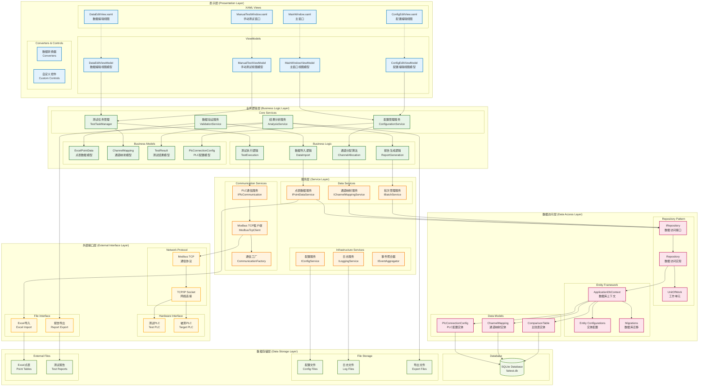

# FatFullVersion 工业自动化测试系统 - 软件分层架构图

## 软件分层架构图

## 分层架构说明

### 1. 表示层 (Presentation Layer)
**职责**: 用户界面展示和用户交互处理
- **XAML Views**: WPF用户界面定义
- **ViewModels**: MVVM模式的视图模型，处理界面逻辑
- **Converters & Controls**: 数据转换器和自定义控件

**技术特点**:
- 采用MVVM架构模式
- 数据绑定和命令模式
- 依赖注入支持

### 2. 业务逻辑层 (Business Logic Layer)
**职责**: 核心业务逻辑处理和业务规则实现
- **Core Services**: 核心业务服务
- **Business Models**: 业务数据模型
- **Business Logic**: 具体业务逻辑实现

**技术特点**:
- 业务规则封装
- 算法实现
- 数据验证

### 3. 服务层 (Service Layer)
**职责**: 提供可重用的服务接口和功能
- **Communication Services**: 通信相关服务
- **Data Services**: 数据处理服务
- **Infrastructure Services**: 基础设施服务

**技术特点**:
- 接口抽象
- 服务注册和发现
- 横切关注点处理

### 4. 数据访问层 (Data Access Layer)
**职责**: 数据持久化和数据库操作
- **Repository Pattern**: 数据访问模式
- **Entity Framework**: ORM框架
- **Data Models**: 数据实体模型

**技术特点**:
- Repository模式
- Entity Framework Core
- 数据库迁移

### 5. 数据存储层 (Data Storage Layer)
**职责**: 数据存储和文件管理
- **Database**: SQLite数据库
- **File Storage**: 文件存储
- **External Files**: 外部文件

**技术特点**:
- SQLite嵌入式数据库
- 文件系统操作
- 数据备份和恢复

### 6. 外部接口层 (External Interface Layer)
**职责**: 与外部系统和硬件的接口
- **Hardware Interface**: 硬件接口
- **Network Protocol**: 网络协议
- **File Interface**: 文件接口

**技术特点**:
- Modbus TCP协议
- 硬件通信
- 文件导入导出

## 层间交互原则

1. **单向依赖**: 上层依赖下层，下层不依赖上层
2. **接口隔离**: 通过接口进行层间通信
3. **依赖注入**: 使用依赖注入容器管理依赖关系
4. **事件驱动**: 使用事件机制实现松耦合通信

## 技术优势

1. **可维护性**: 清晰的分层结构便于维护
2. **可扩展性**: 模块化设计支持功能扩展
3. **可测试性**: 接口抽象便于单元测试
4. **可重用性**: 服务层提供可重用组件

---
*生成时间: 2025年1月*
*适用版本: FatFullVersion V1.0* 