# 数据库表关系图

## 实体关系图 (ERD)

```mermaid
erDiagram
    ChannelPointDefinitions ||--o{ ChannelTestInstances : "1:N"
    TestBatchInfo ||--o{ ChannelTestInstances : "1:N"
    ChannelTestInstances ||--o{ RawTestOutcomes : "1:N"
    PlcConnectionConfigs ||--o{ ChannelPointDefinitions : "1:N"
    TestPlcChannelConfigs ||--o{ ChannelMappingConfigs : "1:N"

    ChannelPointDefinitions {
        string id PK
        string tag UK
        string variable_name
        string variable_description
        string station_name
        string module_name
        string module_type
        string channel_tag_in_module
        string data_type
        string power_supply_type
        string wire_system
        string plc_absolute_address
        string plc_communication_address
        decimal range_lower_limit
        decimal range_upper_limit
        string engineering_unit
        decimal sll_set_value
        string sll_set_point_address
        string sll_set_point_plc_address
        string sll_feedback_address
        string sll_feedback_plc_address
        decimal sl_set_value
        string sl_set_point_address
        string sl_set_point_plc_address
        string sl_feedback_address
        string sl_feedback_plc_address
        decimal sh_set_value
        string sh_set_point_address
        string sh_set_point_plc_address
        string sh_feedback_address
        string sh_feedback_plc_address
        decimal shh_set_value
        string shh_set_point_address
        string shh_set_point_plc_address
        string shh_feedback_address
        string shh_feedback_plc_address
        string maintenance_value_set_point_address
        string maintenance_value_set_point_plc_address
        string maintenance_enable_switch_point_address
        string maintenance_enable_switch_point_plc_address
        string access_property
        boolean save_history
        boolean power_failure_protection
        string test_rig_plc_address
        datetime created_time
        datetime updated_time
    }

    TestBatchInfo {
        string batch_id PK
        string batch_name
        string product_model
        string serial_number
        string customer_name
        string station_name
        datetime created_time
        datetime updated_time
        datetime start_time
        datetime end_time
        bigint total_duration_ms
        string operator_name
        string created_by
        string overall_status
        string status_summary
        string error_message
        int total_points
        int tested_points
        int passed_points
        int failed_points
        int skipped_points
        int not_tested_points
        float progress_percentage
        string current_testing_channel
        string test_configuration
        string import_source
        text custom_data_json
    }

    ChannelTestInstances {
        string instance_id PK
        string definition_id FK
        string test_batch_id FK
        string test_batch_name
        string channel_tag
        string variable_name
        string variable_description
        string module_type
        string data_type
        string plc_communication_address
        string overall_status
        string current_step_details
        string error_message
        datetime created_time
        datetime start_time
        datetime updated_time
        datetime final_test_time
        bigint total_test_duration_ms
        int hard_point_status
        string hard_point_test_result
        string hard_point_error_detail
        string actual_value
        string expected_value
        string current_value
        int low_low_alarm_status
        int low_alarm_status
        int high_alarm_status
        int high_high_alarm_status
        int maintenance_function
        int trend_check
        int report_check
        int show_value_status
        string test_plc_channel_tag
        string test_plc_communication_address
        int test_result_status
        string current_operator
        int retries_count
        text sub_test_results_json
        text hardpoint_readings_json
        text transient_data_json
    }

    RawTestOutcomes {
        string id PK
        string channel_instance_id FK
        string sub_test_item
        boolean success
        string message
        datetime execution_time
        text readings_json
    }

    TestPlcChannelConfigs {
        string id PK
        string channel_address UK
        string channel_type
        string data_type
        string description
        boolean is_enabled
        datetime created_at
        datetime updated_at
    }

    PlcConnectionConfigs {
        string id PK
        string name UK
        string ip_address
        int port
        string protocol_type
        int timeout_ms
        int max_connections
        boolean is_test_plc
        boolean is_enabled
        datetime created_at
        datetime updated_at
    }

    ChannelMappingConfigs {
        string id PK
        string source_channel_id FK
        string target_plc_address
        string mapping_type
        boolean is_enabled
        datetime created_at
        datetime updated_at
    }
```



## 表关系说明

### 核心业务关系

#### 1. ChannelPointDefinitions → ChannelTestInstances (1:N)
- **关系**: 一个通道定义可以创建多个测试实例
- **外键**: `ChannelTestInstances.definition_id` → `ChannelPointDefinitions.id`
- **业务含义**: 同一个通道定义可以在不同批次中被测试多次

#### 2. TestBatchInfo → ChannelTestInstances (1:N)
- **关系**: 一个测试批次包含多个通道测试实例
- **外键**: `ChannelTestInstances.test_batch_id` → `TestBatchInfo.batch_id`
- **业务含义**: 批次是测试的组织单位，包含一组相关的通道测试

#### 3. ChannelTestInstances → RawTestOutcomes (1:N)
- **关系**: 一个测试实例产生多个原始测试结果
- **外键**: `RawTestOutcomes.channel_instance_id` → `ChannelTestInstances.instance_id`
- **业务含义**: 每个通道实例的各个子测试项都会产生测试结果

### 配置管理关系

#### 4. PlcConnectionConfigs → ChannelPointDefinitions (1:N)
- **关系**: 一个PLC连接配置可以服务多个通道定义
- **关联方式**: 通过PLC地址前缀匹配
- **业务含义**: PLC连接配置定义了如何连接到特定的PLC设备

#### 5. TestPlcChannelConfigs → ChannelMappingConfigs (1:N)
- **关系**: 一个测试PLC通道可以映射到多个目标地址
- **外键**: `ChannelMappingConfigs.source_channel_id` → `TestPlcChannelConfigs.id`
- **业务含义**: 测试PLC的通道可以映射到被测系统的多个点位

## 索引策略

### 主键索引
- 所有表的主键自动创建聚集索引
- 使用UUID字符串作为主键，保证全局唯一性

### 外键索引
```sql
-- 测试实例表的外键索引
CREATE INDEX idx_channel_test_instances_definition_id ON channel_test_instances(definition_id);
CREATE INDEX idx_channel_test_instances_batch_id ON channel_test_instances(test_batch_id);

-- 测试结果表的外键索引
CREATE INDEX idx_raw_test_outcomes_instance_id ON raw_test_outcomes(channel_instance_id);

-- 映射配置表的外键索引
CREATE INDEX idx_channel_mapping_configs_source_id ON channel_mapping_configs(source_channel_id);
```

### 业务查询索引
```sql
-- 通道定义表的业务索引
CREATE INDEX idx_channel_point_definitions_tag ON channel_point_definitions(tag);
CREATE INDEX idx_channel_point_definitions_module_type ON channel_point_definitions(module_type);
CREATE INDEX idx_channel_point_definitions_station ON channel_point_definitions(station_name);

-- 测试实例表的业务索引
CREATE INDEX idx_channel_test_instances_status ON channel_test_instances(overall_status);
CREATE INDEX idx_channel_test_instances_operator ON channel_test_instances(current_operator);

-- 批次信息表的业务索引
CREATE INDEX idx_test_batch_info_status ON test_batch_info(overall_status);
CREATE INDEX idx_test_batch_info_created_time ON test_batch_info(created_time);
```

## 数据完整性约束

### 外键约束
```sql
-- 测试实例表的外键约束
ALTER TABLE channel_test_instances 
ADD CONSTRAINT fk_instances_definition 
FOREIGN KEY (definition_id) REFERENCES channel_point_definitions(id);

ALTER TABLE channel_test_instances 
ADD CONSTRAINT fk_instances_batch 
FOREIGN KEY (test_batch_id) REFERENCES test_batch_info(batch_id);

-- 测试结果表的外键约束
ALTER TABLE raw_test_outcomes 
ADD CONSTRAINT fk_outcomes_instance 
FOREIGN KEY (channel_instance_id) REFERENCES channel_test_instances(instance_id);
```

### 唯一性约束
```sql
-- 通道定义表的唯一约束
ALTER TABLE channel_point_definitions 
ADD CONSTRAINT uk_channel_definitions_tag UNIQUE (tag);

-- PLC连接配置表的唯一约束
ALTER TABLE plc_connection_configs 
ADD CONSTRAINT uk_plc_connections_name UNIQUE (name);

-- 测试PLC通道配置表的唯一约束
ALTER TABLE test_plc_channel_configs 
ADD CONSTRAINT uk_test_plc_channels_address UNIQUE (channel_address);
```

### 检查约束
```sql
-- 批次信息表的检查约束
ALTER TABLE test_batch_info 
ADD CONSTRAINT chk_batch_points_positive 
CHECK (total_points >= 0 AND tested_points >= 0 AND passed_points >= 0 AND failed_points >= 0);

ALTER TABLE test_batch_info 
ADD CONSTRAINT chk_batch_progress_range 
CHECK (progress_percentage >= 0.0 AND progress_percentage <= 100.0);

-- 通道定义表的检查约束
ALTER TABLE channel_point_definitions 
ADD CONSTRAINT chk_definition_range_valid 
CHECK (range_lower_limit IS NULL OR range_upper_limit IS NULL OR range_lower_limit < range_upper_limit);
```

## 查询模式

### 常用查询场景

#### 1. 获取批次的所有测试实例
```sql
SELECT cti.*, cpd.tag, cpd.module_type
FROM channel_test_instances cti
JOIN channel_point_definitions cpd ON cti.definition_id = cpd.id
WHERE cti.test_batch_id = ?
ORDER BY cpd.module_type, cpd.tag;
```

#### 2. 获取测试实例的所有结果
```sql
SELECT rto.*
FROM raw_test_outcomes rto
WHERE rto.channel_instance_id = ?
ORDER BY rto.execution_time;
```

#### 3. 统计批次测试进度
```sql
SELECT 
    tbi.batch_name,
    tbi.total_points,
    COUNT(cti.instance_id) as actual_instances,
    SUM(CASE WHEN cti.overall_status = 'TestCompletedPassed' THEN 1 ELSE 0 END) as passed_count,
    SUM(CASE WHEN cti.overall_status = 'TestCompletedFailed' THEN 1 ELSE 0 END) as failed_count
FROM test_batch_info tbi
LEFT JOIN channel_test_instances cti ON tbi.batch_id = cti.test_batch_id
WHERE tbi.batch_id = ?
GROUP BY tbi.batch_id, tbi.batch_name, tbi.total_points;
```

## 数据归档策略

### 历史数据管理
- 测试结果数据按月分区存储
- 超过1年的数据自动归档到历史表
- 保留最近3个月的热数据用于快速查询

### 备份策略
- 每日增量备份测试数据
- 每周全量备份配置数据
- 关键操作前自动创建快照
